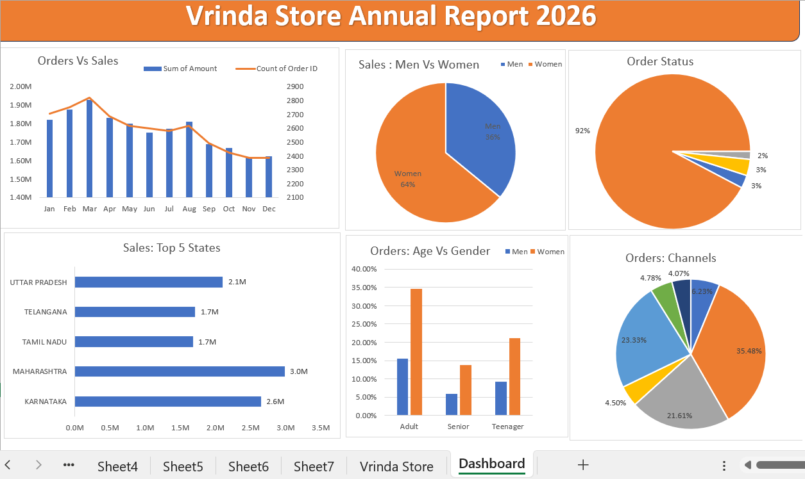
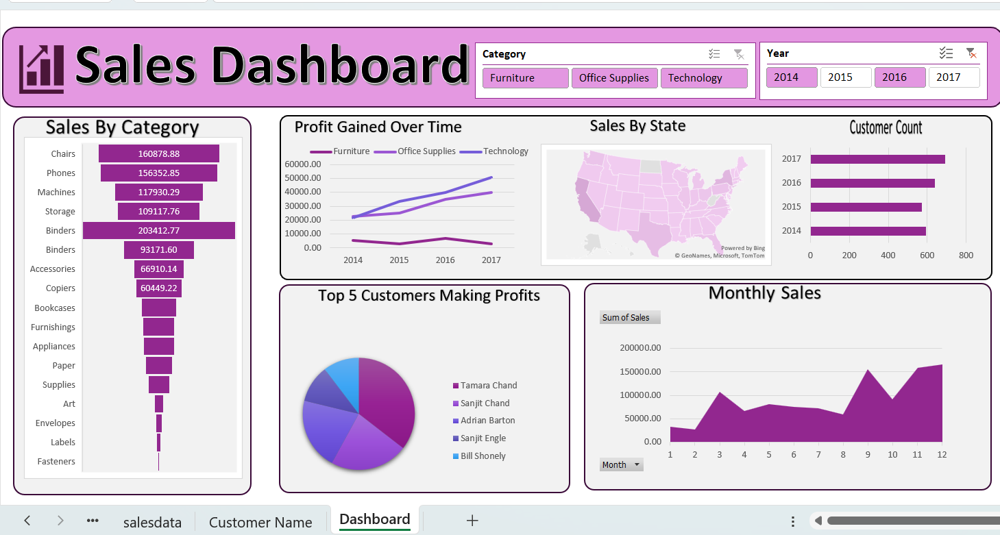

# 📊 Excel Data Analysis Projects

This repository contains **Excel-based data analysis projects** demonstrating my skills in data cleaning, pivot tables, charts, and dashboard creation for business insights.

---

## 📁 Projects Included

---

### 1️⃣ Vrinda Store Data Analysis – Excel Dashboard

#### 📌 Project Overview
Analyzed retail sales data of **Vrinda Store** to understand customer behavior, sales trends, and channel performance using Microsoft Excel.

#### 🛠 Tools & Techniques
- Microsoft Excel
- Data Cleaning
- Pivot Tables
- Pivot Charts
- Slicers
- Interactive Dashboard Design

#### 📈 Dashboard Highlights
- Sales by Gender  
- Orders by Sales Channel  
- Sales by Category  
- Monthly Sales Trend  
- Top Performing States  

#### 🔍 Key Business Insights
- Women customers contributed the majority of total sales  
- Amazon and Flipkart were the top-performing sales channels  
- Maharashtra and Karnataka generated the highest revenue  
- Peak sales were observed during the first quarter  

#### 📷 Dashboard Preview

📂 Files:
- `Vrinda_Store_Data_Analysis.xlsx`
- `dashboard.png`

---

### 2️⃣ Sales Data Analysis – Excel Dashboard

#### 📌 Project Overview
Performed exploratory sales data analysis to identify trends across regions, product categories, and time periods using Excel.

#### 🛠 Tools & Techniques
- Microsoft Excel
- Pivot Tables
- Charts
- Dashboard Design

#### 📷 Sales Dashboard Preview

📂 Files:
- `salesdata.xlsx`
- `salesdashboard.png`

---

## 🎯 Purpose of This Repository
These projects showcase my ability to analyze raw data, extract meaningful insights, and present them in a clear, business-friendly format using Excel.

---

## 📫 Connect with Me
- GitHub: https://github.com/Anchal1811
